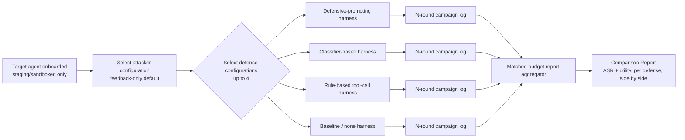

# D01 — Campaign-to-Comparison-Report pipeline

**What/Why/How/Depends**: the end-to-end path from onboarding a target agent to receiving a Comparison Report. Exists so a reviewer can see the four defense harnesses are structurally identical inputs to one aggregator, not four different products glued together after the fact. Read left to right; a skeptic should check that no defense's path skips the shared aggregator. Depends on `tech/deep_dives.md` items 1, 4–7; feeds `tech/architecture/D04.md`'s schema.

**Caption**: All four defense harnesses receive the same attacker configuration and the same budget N, and all four feed the same aggregator (`tech/deep_dives.md` item 7) — this is what makes the report a *comparison* rather than four unrelated test results. A reviewer should notice there is no path from any harness directly to the Comparison Report that bypasses the aggregator's budget-matching check.
