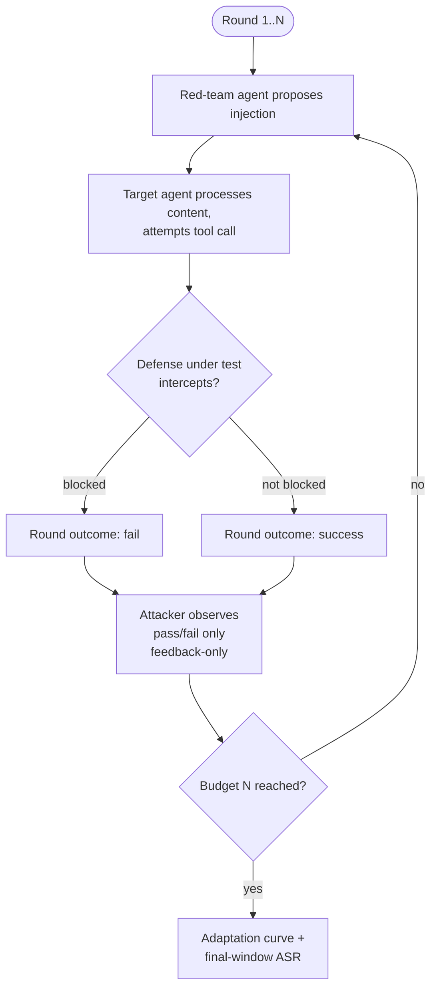

# D02 — Feedback-only round loop

**What/Why/How/Depends**: the single-round adaptive loop, repeated to budget N, that produces one campaign's data. Exists to make the feedback-only information boundary (attacker sees pass/fail, never defense identity) an explicit, checkable diagram property rather than a prose claim. Read top to bottom, following one round at a time; a skeptic should check the attacker's observation edge carries only "pass/fail," nothing else. Depends on `tech/deep_dives.md` item 1 (AutoDojo's optimizer, adapted); feeds `tech/architecture/D01.md`'s per-defense campaign logs.

**Caption**: The observation edge into "Attacker observes pass/fail only" is the entire feedback-only threat model in one arrow — no edge anywhere in this diagram carries defense identity or configuration back to the red-team agent. A reviewer checking whether AgentGuard's primary threat model is real (vs. secretly white-box) should look for exactly this: one thin edge, one bit of information, nothing more.
