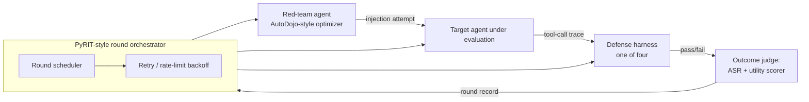

# D03 — Red-team / target / defense / judge orchestration

**What/Why/How/Depends**: the component-level view of who talks to whom within one round, with orchestration plumbing (PyRIT-pattern) drawn as a separate subgraph from the attack logic. Exists so a reviewer can confirm the orchestrator has no attack-generation intelligence of its own — it schedules and retries, nothing more. Read the Orchestrator subgraph first, then trace the three arrows out to the components it coordinates. Depends on `tech/deep_dives.md` items 1, 7, 8; feeds `tech/architecture/D09.md`'s scheduling design.

**Caption**: The Orchestrator subgraph contains only scheduling and retry logic — every piece of adversarial intelligence lives in the Red-team agent box, which is explicitly labeled as AutoDojo-style (adopted, not invented). A reviewer auditing for the "orchestration layer over two academic components" risk (`strategy/positioning.md`) should confirm this diagram doesn't hide a third, unnamed attack mechanism inside the orchestrator itself — it doesn't; the orchestrator's only job is scheduling, retries, and passing the judge's verdict back.
