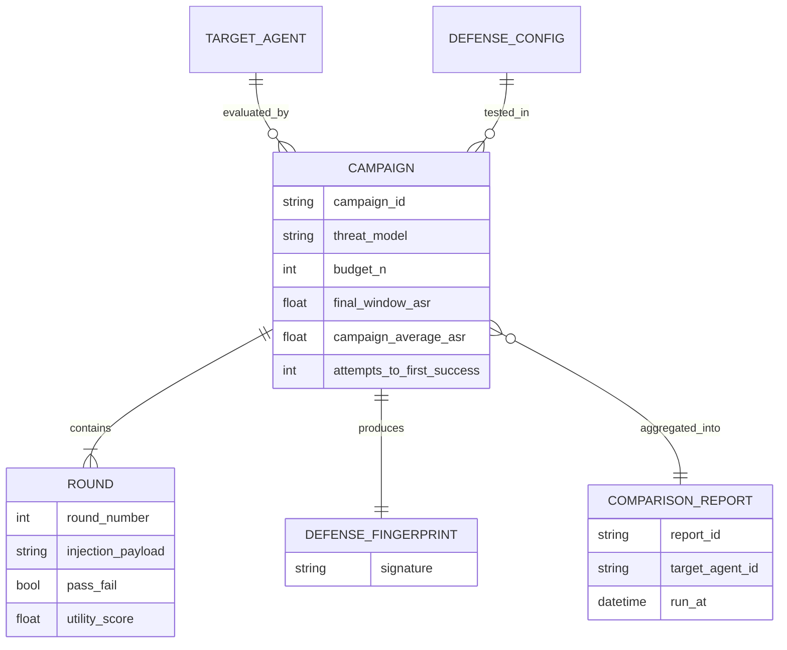

# D04 — Campaign & Comparison Report schema

**What/Why/How/Depends**: the durable data model underneath every campaign and report. Exists so utility-pairing and reproducibility are visibly schema-level guarantees, not reporting-layer decisions applied after the fact. Read the ROUND entity first — it is where the utility-vs-ASR pairing actually happens — then trace up to CAMPAIGN and COMPARISON_REPORT. Depends on `tech/deep_dives.md` item 7; feeds `tech/architecture/D09.md`'s multi-tenant isolation design.

**Caption**: `utility_score` is a field on ROUND, the same entity that carries `pass_fail` — utility and attack success are computed from the same underlying event, not joined from two separate systems after the campaign ends. A reviewer should notice `budget_n` lives on CAMPAIGN and is shared by construction across every campaign that feeds one COMPARISON_REPORT, which is what makes the matched-budget guarantee enforceable in the schema rather than just a policy someone has to remember to follow.
