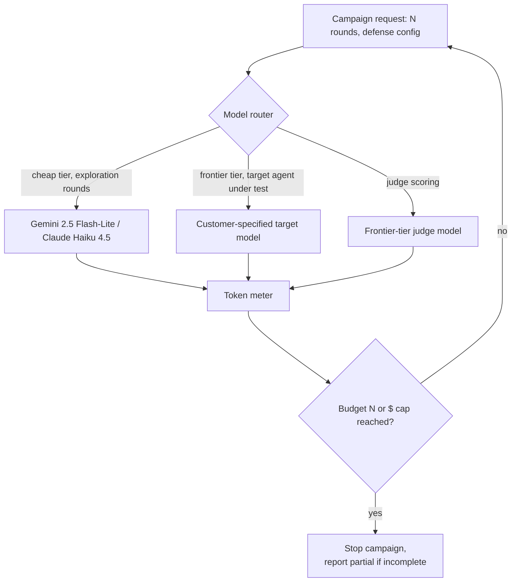

# D05 — Model routing & cost control

**What/Why/How/Depends**: how campaign requests get routed to specific models by role (attacker exploration, target agent, judge scoring) and metered against a budget cap. Exists so `tech/not_vaporware.md`'s cost model is an enforced architectural constraint, not just a spreadsheet estimate. Read left to right, then check the feedback loop back into the router. Depends on `tech/deep_dives.md` items 1, 2 and `research/sources.md` S101–S106 (pricing); feeds `tech/not_vaporware.md`'s cost-model section.

**Caption**: The target agent model is customer-specified (it's their agent under test), while the attacker's exploration calls default to cheap-tier models — this is the routing choice that makes `strategy/market_sizing.md`'s campaign-cost Fermi (≈$12–$190 per 4-defense report) hold in practice, not just in the spreadsheet. A reviewer should notice the token meter feeds a hard stop condition, so a runaway campaign cannot silently exceed its budget — the same discipline the matched-budget design (`tech/whitepaper.md` §2.1) requires for methodological validity also has to hold for cost, or a customer's bill becomes the unmatched variable instead of the attack budget.
