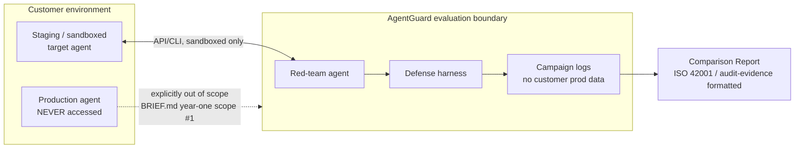

# D06 — Staging-only isolation boundary

**What/Why/How/Depends**: the trust boundary between a customer's production environment (never touched) and AgentGuard's evaluation surface. Exists to make `BRIEF.md`'s year-one scope exclusion ("no production traffic access") a structural property, not a policy promise. Read the dotted line first — it is deliberately drawn as unreachable, not merely unused. Depends on `BRIEF.md` Year-one scope #1; feeds `tech/not_vaporware.md`'s trust/adoption argument.

**Caption**: The only solid-line connection into the customer's environment terminates at Staging, never at Prod — the dotted line to Prod is drawn specifically to show the connection that does not exist, not one that's merely disabled by configuration. A reviewer evaluating trust/adoption risk (the exact objection Sofia Ramirez's persona raises, `strategy/personas.md` persona 5, about disclosure liability against production platforms) should read this as the architectural answer: there is no code path from AgentGuard into a customer's live traffic.
