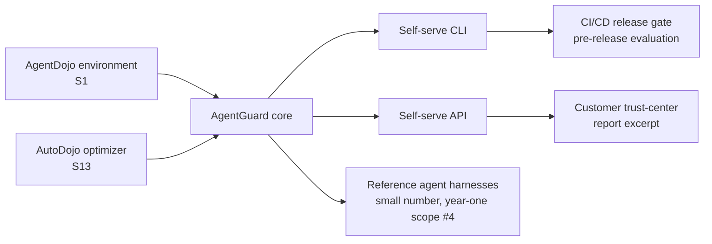

# D07 — Environment and release-pipeline integrations

**What/Why/How/Depends**: how AgentGuard's core sits on top of the two adopted open components (AgentDojo, AutoDojo) and connects outward to a customer's CLI/API usage and release pipeline. Exists to keep the "adopted, not invented" honesty of `ASSUMPTIONS.md` A9 visible at the architecture level, not just in prose. Read bottom-up from the two adopted components into AgentGuard's core, then out to integration points. Depends on `tech/deep_dives.md` items 1, 7; feeds `tech/not_vaporware.md`'s stack-choices section.

**Caption**: Both inbound arrows into AgentGuard's core are labeled with their source citations (S1, S13) rather than left generic — a reviewer checking for the "wrapper" risk (`strategy/positioning.md`) should be able to trace every box in this diagram back to a named, cited component, with nothing unlabeled in between. The CI/CD and trust-center integration points on the right show the two concrete ways a customer actually consumes the output (Marcus Webb's release-ticket use case and Sofia Ramirez's trust-center use case, `strategy/personas.md`), not a generic "dashboard."
