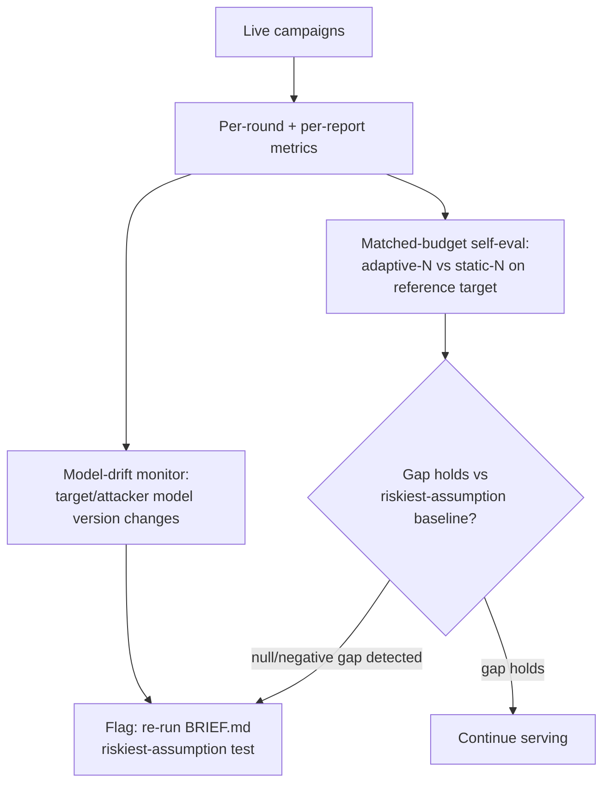

# D08 — AgentGuard's own quality loop

**What/Why/How/Depends**: how AgentGuard continuously checks that its own core claim (adaptive beats static, at matched budget) still holds, rather than trusting a one-time validation forever. Exists because `BRIEF.md`'s riskiest-assumption test is a two-week validation exercise, not a permanent guarantee — model versions and defenses both drift. Read the loop as never-terminating; a skeptic should check there is no "done" state. Depends on `BRIEF.md` Riskiest assumption; feeds `tech/not_vaporware.md`'s evaluation-loop section directly (same design, not a different one).

**Caption**: The self-eval step re-runs the exact matched-budget design from `BRIEF.md`'s riskiest-assumption test — the same adaptive-N-vs-static-N-at-equal-budget comparison, not a different internal metric — against a fixed reference target on a recurring basis. A reviewer should notice the "null/negative gap detected" branch is a real, honored outcome (per `BRIEF.md`'s own instruction that a null result "is a valid, reportable outcome"), not a dead end that gets silently ignored if the news is bad — the same finding from `research/survey.md` §6.2 (the adaptive advantage may be shrinking against frontier models) is exactly what this loop is built to catch early.
