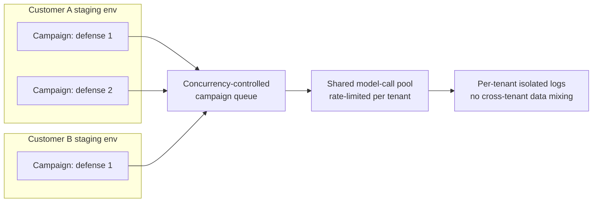

# D09 — Multi-tenant scalability

**What/Why/How/Depends**: how concurrent campaigns from different customers share compute without sharing data. Exists because `BRIEF.md`'s edge-high tier (continuous, high-volume campaigns) and beachhead tier (per-release campaigns) run on the same infrastructure, and isolation has to hold at both scales. Read each tenant subgraph first, then follow both into the shared pool and note where isolation is re-imposed on the way out. Depends on `tech/deep_dives.md` items 7, 8; feeds `BRIEF.md`'s Moat hypothesis (an accumulating cross-customer corpus, if it ever exists, must not violate this isolation).

**Caption**: Compute is shared (the Pool) but logs are re-partitioned per tenant on the way out (IsoLogs) — a reviewer should notice this is the exact architectural point where `BRIEF.md`'s unproven Moat hypothesis (an accumulating, reproducible comparison corpus) would have to be built deliberately and separately, with explicit customer consent, rather than assumed to fall out of shared infrastructure for free. Nothing in this diagram implies that corpus exists today — it is drawn to show where the isolation boundary that any future aggregation would have to cross deliberately, not accidentally, currently sits.
