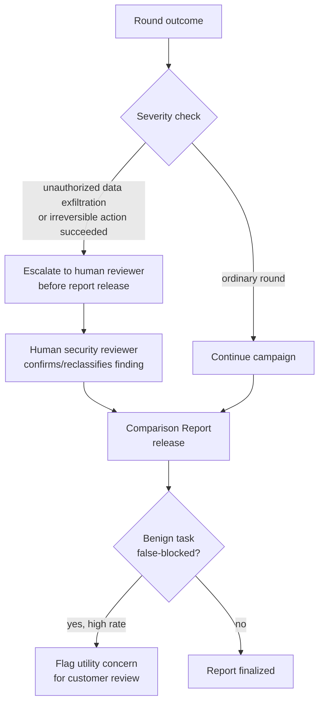

# D10 — Critical-finding and false-block escalation

**What/Why/How/Depends**: what happens when a round succeeds at something severe (data exfiltration, an irreversible action) or when a defense over-blocks legitimate work — both routed to a human rather than surfaced only in an aggregate statistic. Exists because Dr. Elena Osei's persona (`strategy/personas.md` persona 3) needs a defensible, board-legible answer, not a raw log a human has to mine for the finding that actually matters. Read the severity branch first, then the benign-block branch at the bottom — they are two different escalation triggers, not one. Depends on `BRIEF.md` Year-one scope and Vocabulary (utility vs. benign block rate); feeds the Comparison Report's presentation layer (not yet specified in `product/`, which does not exist yet at time of writing).

**Caption**: Escalation triggers on severity (exfiltration, irreversible actions), not on every failed round — a reviewer should check this doesn't quietly suppress ordinary findings by routing everything through a human bottleneck; only the severe branch reaches a human, the ordinary branch flows straight to the report. The separate BlockCheck branch at the bottom exists because utility and benign block rate are deliberately distinct metrics (`BRIEF.md` Vocabulary) — a defense can pass the severity check cleanly and still deserve a utility flag for blocking legitimate work, and this diagram keeps those two escalation paths visibly separate rather than collapsing them into one "problem found" signal.
